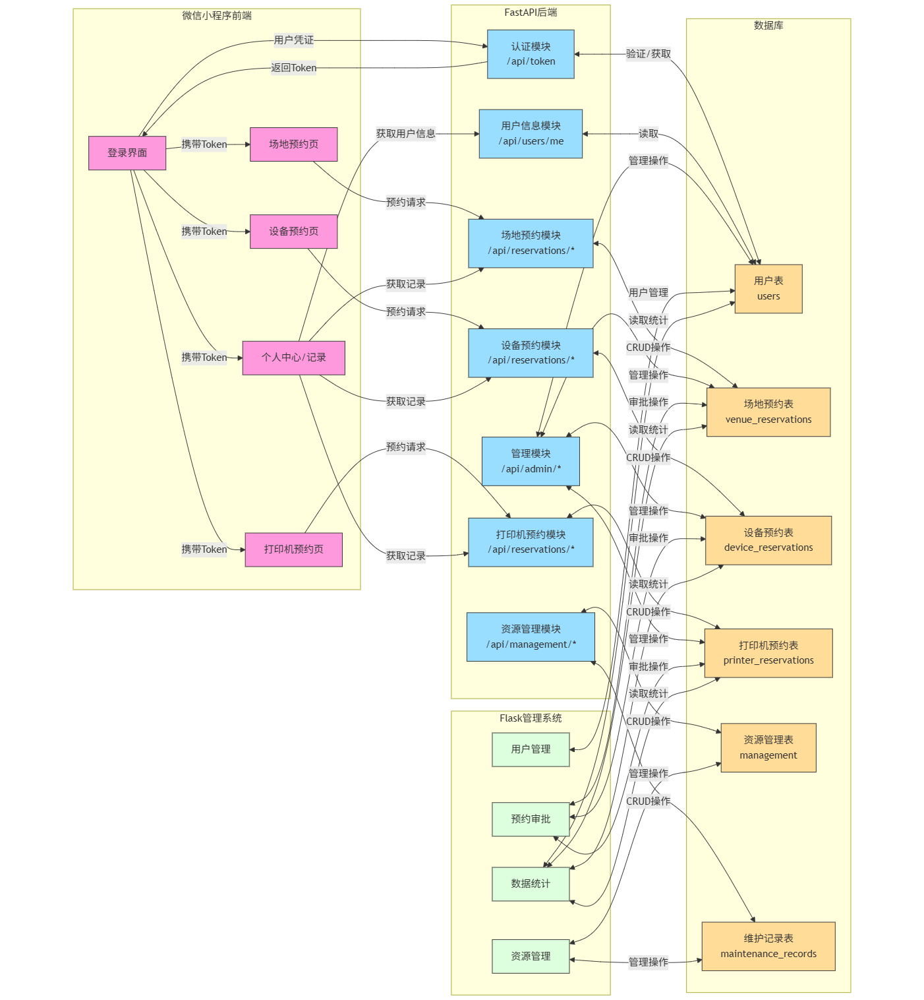
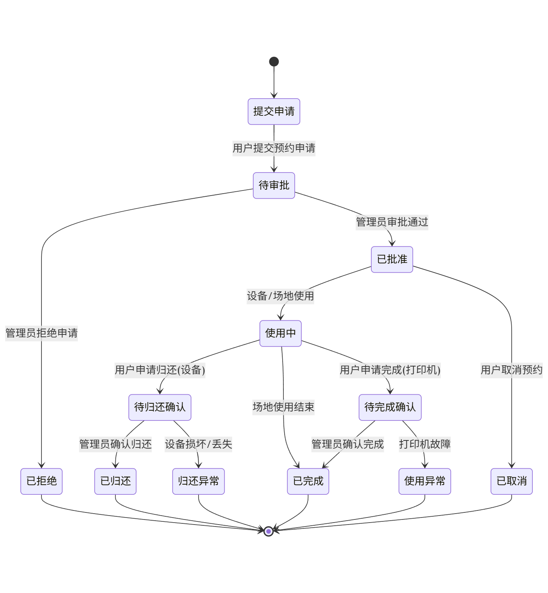

<div align="center">
  
</div>

# 创新工坊预约系统

一个全功能的场地、设备和打印机预约管理系统，专为高校创新工坊设计，支持多角色用户管理、预约审批流程、资源调度和实时状态跟踪。

## 系统架构图

<div align="center">
  
</div>

## 数据流转图



## 审批流程图



## 项目背景与目标

创新工坊预约系统是一个面向高校师生的综合资源管理平台，旨在解决创新工坊场地、设备和打印机等资源的预约、管理和使用问题。系统支持多角色用户（学生、教师、管理员）分级管理，提供直观的用户界面和完善的后台管理功能，实现资源的高效利用与透明管理。

主要目标用户包括：(需求在docs/command.md里面)

- 学生：预约使用创新工坊的场地、设备和3D打印机
- 教师：指导学生并审批预约请求
- 管理员：管理系统资源、用户和审批流程

## 项目结构说明

项目采用前后端分离架构，包含以下主要模块：

### 核心模块

- **app/**：FastAPI后端核心模块，提供RESTful API接口

  - `models/`：数据模型定义（用户、预约、设备等）
  - `routers/`：API路由和业务逻辑实现
  - `schemas/`：API请求和响应的数据模型
  - `utils/`：工具函数集合（认证、数据处理等）
  - `db/`：数据库初始化和迁移脚本
  - `database.py`：数据库连接配置
  - `main.py`：应用入口和配置
- **admin_system/**：基于Flask的后台管理系统

  - `app/`：Flask应用核心
    - `templates/`：管理界面HTML模板
    - `static/`：CSS、JavaScript等静态资源
    - `routes/`：管理界面路由和视图函数
    - `models.py`：管理系统数据模型
    - `services/`：业务逻辑服务层
  - `run.py`：管理系统启动脚本
  - `create_admin.py`：管理员账号创建工具
- **fore/**：微信小程序前端（用于用户端操作）

  - `pages/`：小程序页面组件
    - `index/`：首页
    - `venue/`：场地预约相关页面
    - `device/`：设备预约相关页面
    - `printer/`：打印机预约相关页面
    - `my/`：个人中心
    - `approval/`：审批相关页面
    - `records/`：预约记录查询
  - `miniapp/`：小程序核心组件和工具
  - `utils/`：前端工具函数
  - `images/`：图像资源
  - `app.js`：小程序入口配置

### 辅助文件

- `runme.py`：项目一键启动脚本，同时启动FastAPI和Flask服务
- `requirements.txt`：项目依赖列表
- `user_template.xlsx`：用户批量导入模板
- `app.db`：SQLite数据库文件

## 核心功能概述

### 用户管理

- 多角色用户系统：支持学生、教师和管理员角色
- 账号管理：支持单个和批量创建用户账号
- 认证授权：基于JWT的用户认证和权限控制

### 场地预约

- 多种场地类型：讲座厅、研讨室、会议室等
- 分时段预约：上午、下午、晚上三个时段
- 设备需求：支持同时预约场地附属设备（大屏、笔记本、麦克风等）
- 预约审批：预约申请提交后需经管理员审批

### 设备预约

- 设备借用：支持多种设备类型（电动螺丝刀、万用表等）
- 使用方式：支持现场使用和外借两种模式
- 借还流程：完整的借用申请、审批、归还、验收流程
- 设备状态跟踪：记录设备状态变化

### 打印机预约

- 3D打印机管理：支持多台打印机预约
- 时间段预约：精确到小时的预约时间管理
- 打印完成确认：使用完成后的状态确认和审批

### 后台管理

- 资源管理：场地、设备、打印机的增删改查
- 预约审批：集中处理各类预约申请
- 维护记录：设备维护和检修记录管理
- 用户管理：用户账号的创建和权限调整

## 技术栈与依赖

### 后端

- **FastAPI**：主要API服务框架
- **Flask**：管理系统Web框架
- **SQLAlchemy**：ORM数据库映射工具
- **Pydantic**：数据验证和序列化
- **JWT**：用户认证和授权
- **Uvicorn**：ASGI服务器

### 前端

- **微信小程序**：用户端界面
- **Bootstrap**：管理系统UI框架
- **jQuery**：管理系统JavaScript库

### 数据库

- **SQLite**：开发环境数据存储
- 支持迁移到其他关系型数据库（MySQL、PostgreSQL等）

## 安装部署说明

### 环境要求

- Python 3.8+
- Node.js 12+（用于微信小程序开发）
- 微信开发者工具（用于前端开发和调试）

### 安装步骤

1. 克隆代码库

```bash
git clone [仓库地址]
cd [项目目录]
```

2. 安装后端依赖

```bash
python3 -m venv myvenv
source myvenv/bin/activate  # Linux/Mac
.\venv\Scripts\activate   # Windows
pip install -r requirements.txt
```

3. 初始化数据库

```bash
# 首次运行会自动初始化数据库
python runme.py
```

4. 创建管理员账号

```bash
cd admin_system
python create_admin.py --username admin --password your_password
```

5. 启动项目

```bash
python runme.py
```

6. 编译前端

```bash
# 使用微信开发者工具打开fore目录
# 编译并预览小程序
```

### 配置说明

- 后端API服务运行在 `http://localhost:8001`
- 管理系统运行在 `http://localhost:5000`
- 数据库文件位于项目根目录的 `app.db`

## 使用说明

### 用户端（小程序）

1. 登录：使用分配的账号和密码登录系统
2. 场地预约：选择场地类型、日期和时段进行预约
3. 设备预约：选择设备、借用时间和归还时间
4. 打印机预约：选择打印机和使用时间段
5. 我的预约：查看个人预约记录和状态

### 管理系统

1. 登录：访问 `http://localhost:5000` 并使用管理员账号登录
2. 用户管理：创建和管理用户账号
3. 资源管理：管理场地、设备和打印机
4. 预约管理：处理预约申请和查看预约记录
5. 系统设置：调整系统参数和权限设置

### 演示账号

- 管理员：用户名 `admin`，密码 `admin123`
- 学生用户：用户名 `student`，密码 `123456`
- 教师用户：用户名 `teacher`，密码 `123456`

## 常见问题与维护建议

### 常见问题

1. **启动失败**

   - 检查依赖是否完整安装
   - 检查端口是否被占用（8001和5000）
   - 查看日志输出定位具体错误
2. **数据库错误**

   - 检查数据库文件权限
   - 如数据库损坏，可删除 `app.db` 并重新启动系统初始化
3. **前端连接失败**

   - 检查API地址配置（`fore/config.js`）
   - 确保后端服务正常运行

### 维护建议

1. **数据备份**

   - 定期备份 `app.db` 文件
   - 考虑使用生产环境数据库（MySQL/PostgreSQL）
2. **系统升级**

   - 先在测试环境验证新功能
   - 升级前备份数据库和配置文件
3. **性能优化**

   - 监控API响应时间和数据库查询性能
   - 适当调整并发连接数和缓存策略
   - 测试命令（test）：locust -f locustfile.py --host=[http://localhost:8001](http://localhost:8001/)

## 开发者与贡献说明

本项目支持社区贡献，欢迎通过以下方式参与：

- 提交Issue报告Bug或建议新功能
- 提交Pull Request改进代码
- 完善文档和使用说明

### 开发规范

- 代码风格遵循PEP 8规范
- 提交信息使用明确的描述（feat/fix/docs/style等前缀）
- 新功能需包含必要的测试用例
