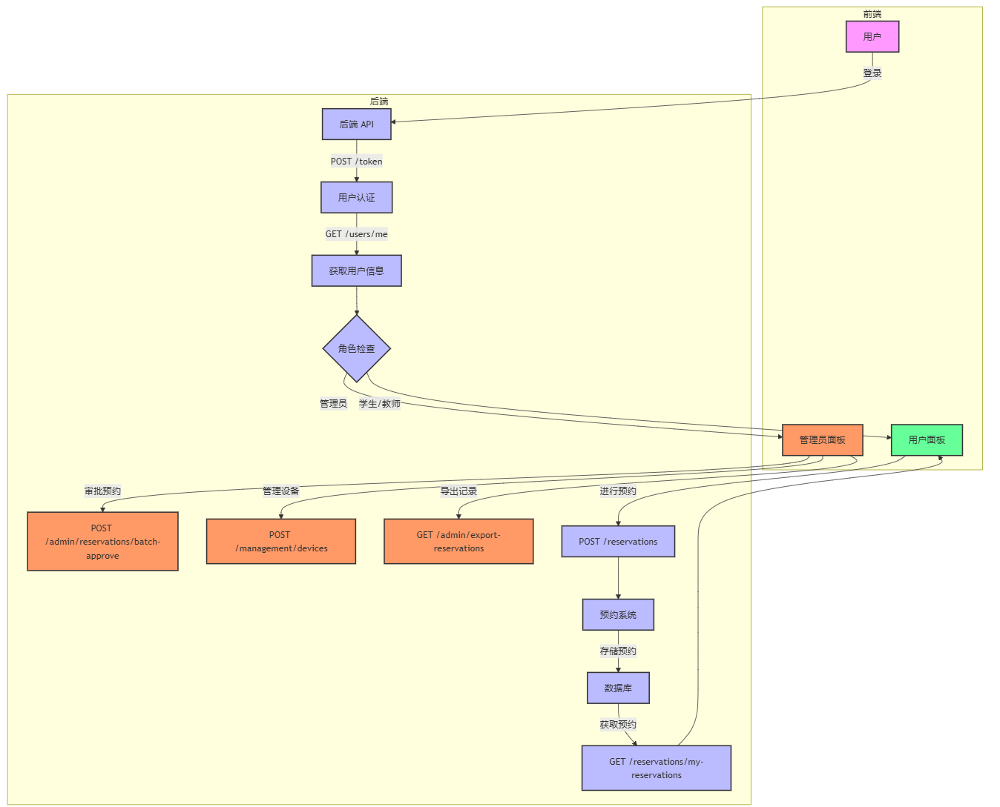

# 创新实验室预约系统

locust -f locustfile.py --host=http://localhost:8001

666

一个基于FastAPI和微信小程序的实验室预约管理系统。(需求在docs/command.md里面)



## 项目结构

```
project/
├── app/                    # 主应用
│   ├── models/            # 数据库模型
│   ├── routers/           # API路由
│   ├── utils/             # 工具函数
│   ├── database.py
│   └── main.py           # 后端入口文件
├── admin_system/          # 后台管理系统
│   ├── app/
│   │   ├── models.py
│   │   └── routes/
│   ├── create_admin.py
│   └── run.py
├── fore/                  # 微信小程序前端
├── DB/                    # 数据库相关脚本
├── test/                  # 创建审批管理员的账号
└── README.md
```

## 环境要求

### 后端环境

- Python 3.8+
- FastAPI
- SQLAlchemy
- uvicorn
- SQLite

### 前端环境

- 微信开发者工具
- Node.js 12+

## 快速开始

### 1. 后端启动

1. 创建并激活虚拟环境

```bash
python3 -m venv myvenv
source myvenv/bin/activate  # Linux/Mac
.\venv\Scripts\activate   # Windows
```

2. 安装依赖

```bash
pip install -r requirements.txt
pip install -r requirements.txt --no-cache-dir #使用 --no-cache-dir 参数可以确保完全重新安装，避免使用缓存的包。
```

   3.启动后端服务（自动创建主业务数据库app.db）

```bash
python run.py
```

服务将在 http://localhost:8001 启动，API文档可访问 http://localhost:8001/docs（API文档在仓库的docs中Backbone也有）

### 2. 前端启动

1. 打开微信开发者工具
2. 导入项目

- 选择项目目录中的 `fore` 文件夹
- 填入自己的小程序 AppID（可使用测试号）

3. 修改配置

- 打开 `fore/config.js`
- 确认 `baseUrl` 配置正确（默认为 `http://localhost:8001/api`）

4. 编译运行

- 点击开发者工具的"编译"按钮

## 测试账号（测试账号需要先在后台管理界面导入)

```
审批管理员账号：
- 用户名：1
- 密码：1

学生/教师账号：
- 用户名：2021001
- 密码：123456

后台管理账号（create_admin.py生成，在admin.db里面)：
- 用户名：admin
- 密码：admin123
```

## 主要功能

1. 用户认证

   - 登录/登出
   - 角色权限控制
2. 场地预约

   - 讲座
   - 研讨室
   - 会议室
3. 设备预约

   - 电动螺丝刀
   - 万用表
4. 3D打印机预约

   - 支持多台打印机预约
5. 管理功能

   - 预约审批
   - 设备管理
   - 用户管理
   - 数据导出

## 开发说明

* 其他设备可以通过你的 IP 地址访问（例如：http://192.168.1.100:5000）
* 本地仍然可以通过 localhost:5000 或 127.0.0.1:5000 访问
* 在生产环境中要注意安全性，建议使用反向代理（如 Nginx）
* FastAPI 后端：http://your-ip:8001
* Flask 管理系统：http://your-ip:5000

### API文档

- 启动后端服务后访问 http://localhost:8001/docs 查看完整API文档
- 支持在线调试API接口

### 数据库

- 默认使用SQLite数据库（app.db）

## 注意事项

1. 确保后端服务器启动后再运行小程序
2. 小程序需要在微信开发者工具中设置不校验合法域名
3. 生产环境部署时需要修改相关配置和域名设置

## 贡献指南

1. Fork 本仓库
2. 创建新的分支 `git checkout -b feature/your-feature`
3. 提交更改 `git commit -m 'Add some feature'`
4. 推送到分支 `git push origin feature/your-feature`
5. 提交 Pull Request
