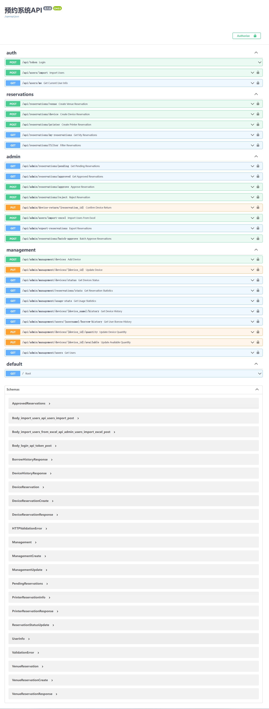

# 预约系统 API 文档



## 基础信息

- 基础URL: `http://localhost:8001/api`
- 认证方式: Bearer Token
- 所有需要认证的接口都需要在请求头中添加: `Authorization: Bearer {token}`

## 1. 认证相关接口

### 1.1 用户登录

```
POST /token
Content-Type: application/x-www-form-urlencoded

请求参数:
- username: 用户名/学号
- password: 密码
- grant_type: "password"

返回:
{
    "access_token": "string",
    "token_type": "bearer",
    "role": "student|teacher|admin"
}
```

### 1.2 获取当前用户信息

```
GET /users/me

返回:
{
    "username": "string",
    "name": "string",
    "department": "string",
    "role": "student|teacher|admin"
}
```

## 2. 预约管理接口

### 2.1 场地预约

```
POST /reservations/venue

请求体:
{
    "venue_type": "lecture|seminar|meeting_room",
    "reservation_date": "YYYY-MM-DD",
    "business_time": "morning|afternoon|evening",
    "purpose": "string",
    "devices_needed": {
        "screen": boolean,
        "laptop": boolean,
        "mic_handheld": boolean,
        "mic_gooseneck": boolean,
        "projector": boolean
    }
}
```

### 2.2 设备预约

```
POST /reservations/device

请求体:
{
    "device_name": "electric_screwdriver|multimeter",
    "borrow_time": "YYYY-MM-DDTHH:mm:ss",
    "return_time": "YYYY-MM-DDTHH:mm:ss",
    "reason": "string"
}
```

### 2.3 3D打印机预约

```
POST /reservations/printer

请求体:
{
    "printer_name": "printer_1|printer_2|printer_3",
    "reservation_date": "YYYY-MM-DD",
    "print_time": "YYYY-MM-DDTHH:mm:ss"
}
```

### 2.4 查看个人预约记录

```
GET /reservations/my-reservations

返回:
{
    "venue_reservations": [...],
    "device_reservations": [...],
    "printer_reservations": [...]
}
```

## 3. 管理员接口

### 3.1 查看待审批预约

```
GET /admin/reservations/pending

返回:
{
    "venue_reservations": [...],
    "device_reservations": [...],
    "printer_reservations": [...]
}
```

### 3.2 批量审批预约

```
POST /admin/reservations/batch-approve

请求体:
{
    "reservation_ids": [number],
    "reservation_type": "venue|device|printer",
    "action": "approve|reject"
}
```

### 3.3 确认设备归还

```
PUT /admin/device-return/{reservation_id}
```

### 3.4 导入用户数据

```
POST /admin/users/import-excel
Content-Type: multipart/form-data

参数:
- file: Excel文件（包含列：学号/工号、姓名、学院、身份证号后6位）
```

### 3.5 导出预约记录

```
GET /admin/export-reservations

返回: Excel文件
```

### 3.6 获取设备状态

```
GET /management/devices/status

查询参数:
- category: "device|venue|printer"

返回:
{
    "devices": [
        {
            "id": "string",
            "name": "string",
            "status": "available|maintenance"
        }
    ]
}
```

## 4. 数据模型

### 4.1 用户角色

- student: 学生
- teacher: 教师
- admin: 管理员

### 4.2 预约状态

- pending: 待审批
- approved: 已通过
- rejected: 已拒绝
- returned: 已归还（仅设备预约）

### 4.3 场地类型

- lecture: 讲座
- seminar: 研讨室
- meeting_room: 会议室

### 4.4 时间段

- morning: 上午
- afternoon: 下午
- evening: 晚上

## 5. 注意事项

1. 场地预约需提前3天
2. 3D打印机需提前1天
3. 设备可随时预约
4. 管理员功能需要管理员权限
5. 所有时间格式均使用 ISO 格式 (YYYY-MM-DDTHH:mm:ss)
6. 文件上传使用 multipart/form-data 格式
